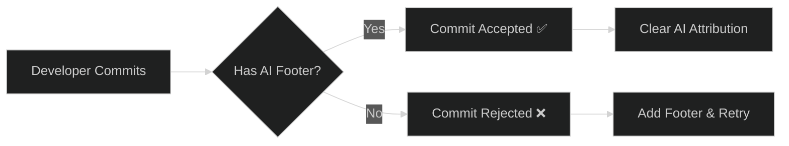

<div align="center">


**Stop playing hide-and-seek with AI in your commits.**

_A dual-language validation framework that makes AI attribution non-negotiable._

---

### 📊 Project Stats

[](https://github.com/anchildress1/rai-lint/stargazers) [](https://github.com/anchildress1/rai-lint/issues) [](https://github.com/anchildress1/rai-lint/releases) [](LICENSE)

[](https://sonarcloud.io/summary/new_code?id=anchildress1_rai-lint) [](https://sonarcloud.io/summary/new_code?id=anchildress1_rai-lint) [](https://sonarcloud.io/summary/new_code?id=anchildress1_rai-lint) [](https://sonarcloud.io/summary/new_code?id=anchildress1_rai-lint)

### 🗣️ Languages

[](https://developer.mozilla.org/en-US/docs/Web/JavaScript) [](https://www.typescriptlang.org/) [](https://www.python.org/)

### 📦 Packages

[](https://www.npmjs.com/package/commitlint-plugin-rai) [](https://pypi.org/project/gitlint-rai/)

### 🤖 AI & Automation

[](https://verdent.ai) [](https://github.com/features/copilot) [](http://chatgpt.com) 

### 🔧 Quality & Standards

[](https://conventionalcommits.org/) [](https://commitlint.js.org/) [](https://eslint.org/) 

 

---

[Installation](#installation-) • [Quick Start](#quick-start-) • [Required Commit Footers](#required-commit-footers-) • [Documentation](/docs)

</div>

---

## What is this? 🤖

RAI Lint enforces **Responsible AI (RAI) attribution** in every commit. No more "who wrote this?" moments. No more mystery code. Just honest, trackable AI contributions.

**Read the full story:** [Did AI Erase Attribution? Your Git History Is Missing a Co-Author](https://dev.to/anchildress1/did-ai-erase-attribution-your-git-history-is-missing-a-co-author-1m2l)



### Why does this exist?

Because transparency matters. When AI writes code, everyone should know. This isn't about fear or compliance theater—it's about building trust and maintaining clear audit trails.

---

## Features 🎯

<table>
<tr>
<td width="50%">

### 🔒 **Enforcement by Default**

Blocks commits without valid AI attribution footers. No exceptions.

### 🌍 **Dual-Language Support**

Native plugins for both JavaScript/TypeScript (`commitlint`) and Python (`gitlint`).

</td>
<td width="50%">

### 📊 **Five Attribution Levels**

From human-only to AI-generated, track exactly who did what.

### ⚡ **Zero Config Start**

Works out-of-the-box with sensible defaults. Customize when ready.

</td>
</tr>
</table>

---

## Required Commit Footers 🏷️

Every commit **must** include:

1. **One AI attribution footer** (pick the one that fits)
2. **Signed-off-by footer** (recommended for complete accountability)

> **💡 Best Practice:** While only the RAI footer is strictly enforced, combining it with `Signed-off-by` creates a complete audit trail—AI attribution plus human accountability. We strongly recommend enforcing both.

### AI Attribution Footers

Pick **one** of these based on AI involvement:

<table>
<thead>
<tr>
<th width="30%">Footer Format</th>
<th width="40%">When to Use</th>
<th width="30%">Example</th>
</tr>
</thead>
<tbody>
<tr>
<td><code>Authored-by</code></td>
<td>Human-only work, zero AI involvement</td>
<td><code>Authored-by: Jane Doe &lt;jane@example.com&gt;</code></td>
</tr>
<tr>
<td><code>Commit-generated-by</code></td>
<td>Trivial AI help (docs, messages, reviews)</td>
<td><code>Commit-generated-by: ChatGPT &lt;chatgpt@openai.com&gt;</code></td>
</tr>
<tr>
<td><code>Assisted-by</code></td>
<td>AI helped, but human did primary work</td>
<td><code>Assisted-by: GitHub Copilot &lt;copilot@github.com&gt;</code></td>
</tr>
<tr>
<td><code>Co-authored-by</code></td>
<td>Roughly 50/50 AI and human split</td>
<td><code>Co-authored-by: Verdent AI &lt;verdent@verdent.ai&gt;</code></td>
</tr>
<tr>
<td><code>Generated-by</code></td>
<td>Majority AI-generated code</td>
<td><code>Generated-by: GitHub Copilot &lt;copilot@github.com&gt;</code></td>
</tr>
</tbody>
</table>

### Signed-off-by Footer

**Human accountability.** This is YOUR stamp confirming you reviewed and take responsibility for the AI attribution above.

Format: `Signed-off-by: Your Name <your.email@example.com>`

**Automate it:** `git commit -s` (or `--signoff`)

> [!NOTE]
> All patterns are case-insensitive and follow the [Git trailer format](https://git-scm.com/docs/git-interpret-trailers). Email addresses **must** use angle brackets (`Name <email@example.com>`) — this is stricter than Git's spec but matches Git's own convention and ensures consistency.
>
> **By default, only RAI footers are enforced.** Enforce `Signed-off-by` too via commitlint's built-in `signed-off-by` rule or gitlint's `contrib-body-requires-signed-off-by` contrib rule.

---

## Installation 📦

### Node.js / Commitlint

```bash
npm install --save-dev commitlint-plugin-rai
```

**Configure in `commitlint.config.js`:**

```javascript
export default {
  extends: ['@commitlint/config-conventional'],
  plugins: ['commitlint-plugin-rai'],
  rules: {
    'rai-footer-exists': [2, 'always'],
    'signed-off-by': [2, 'always'],
  },
};
```

### Python / Gitlint

```bash
uv add gitlint-rai
```

**Run the bundled `gitlint-rai` CLI (recommended)** — it loads the RAI rules automatically and accepts all gitlint arguments:

```bash
gitlint-rai --msg-filename .git/COMMIT_EDITMSG
```

**Or point plain `gitlint` at the installed package in `.gitlint`:**

```ini
[general]
extra-path=/path/to/site-packages/gitlint_rai
```

Get that path with:

```bash
python -c "import gitlint_rai, pathlib; print(pathlib.Path(gitlint_rai.__file__).parent)"
```

---

## Quick Start 🚀

### Hook Integration

<details>
<summary><b>Lefthook</b></summary>

```yaml
commit-msg:
  commands:
    commitlint:
      run: npx --no-install commitlint --edit {1}
```

</details>

<details>
<summary><b>Husky</b></summary>

```bash
npx husky add .husky/commit-msg 'npx --no-install commitlint --edit $1'
```

</details>

<details>
<summary><b>pre-commit</b></summary>

```yaml
repos:
  - repo: local
    hooks:
      - id: gitlint
        name: gitlint
        entry: gitlint-rai
        args: [--msg-filename]
        language: python
        additional_dependencies: ['gitlint-rai']
        stages: [commit-msg]
```

</details>

---

## Monorepo Structure 🛠️

```
rai-lint/
├── packages/
│   ├── node-commitlint/          # Node.js/ESM plugin
│   │   ├── src/
│   │   │   ├── rules/
│   │   │   │   └── rai-footer-exists.ts
│   │   │   └── index.ts
│   │   |── package.json
│   │   ├── tests/
│   │
│   └── python-gitlint/            # Python plugin
│       ├── gitlint_rai/
│       │   ├── __init__.py
│       │   └── rules.py
│       ├── tests/
│       └── pyproject.toml
│
├── docs/                          # Documentation
```

---

## Contributing 🤝

Contributions welcome! See [CONTRIBUTING.md](CONTRIBUTING.md) for guidelines.

---

## License 📄

Look, I'm not gonna hide behind a wall of legalese here.

This runs on [Polyform Shield License 1.0.0](./LICENSE). That's **not open source** — but before you rage-quit, hear me out.

**What this means in actual English:**

Use it. Break it. Fix it. Ship it in your CI pipeline at work. Hell, use it to enforce commit messages on your team and become the office villain. I'm cool with all of that.

What I'm _not_ cool with? Someone spinning this up as "AI Lint Pro" with a $99/month subscription and a fancy landing page. If you want to make money off this code, we should probably have a conversation first.

**The vibe:** This is a tool to solve a real problem — AI attribution in commits is messy, and someone needed to standardize it. If you're using it for that purpose, internal or otherwise, you're good. If you're thinking about monetizing it... let's chat.

Sound fair? Cool. Now go lint some commits. 🚀

---

## Show Some Love 🫶

If you find this project useful or want to support its development, consider starring the repo or connecting with me!

[](https://www.buymeacoffee.com/anchildress1) [](https://dev.to/anchildress1) [](https://www.linkedin.com/in/anchildress1/)

---

<div align="center">

_Stop guessing. Start tracking._

**Co-authored-by: Claude, Codex, Verdent AI & GitHub Copilot**

</div>
