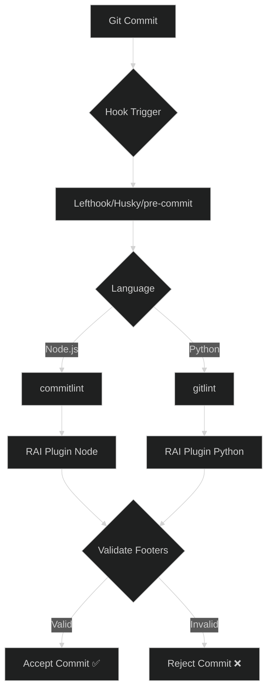

# Architecture Overview

RAI Lint is a dual-language monorepo implementing identical commit validation logic across Node.js and Python ecosystems.

Two rules ship in each plugin:

- **`rai-footer-exists`** (gitlint id `UC1`) — requires an AI attribution footer
- **`rai-signed-off-by`** (gitlint id `UC2`) — requires a DCO-style `Signed-off-by` footer, the human stamp over the attribution (`git commit -s`)

## RAI Footer Validation Logic

Both implementations share one validation strategy: scan the full commit message with the same anchored line regex — no structured trailer parsing on either side. This keeps behavior explicit, easy to debug, and consistent across ecosystems for real-world commit messages.

Each pattern matches a complete line of the form `Key: Name <contact>`:

- Recognized keys: `Authored-by`, `Commit-generated-by`, `Assisted-by`, `Co-authored-by`, `Generated-by`
- Case-insensitive key matching
- Requires whitespace after the colon, a non-empty name, and whitespace before `<contact>`
- A footer cannot span multiple lines (CRLF line endings are tolerated)
- A matching line anywhere in the message satisfies the rule

The Node plugin (`packages/node-commitlint/src/rules/`) and the Python plugin (`packages/python-gitlint/gitlint_rai/rules.py`) build their patterns from the same key list and pattern template. `rai-signed-off-by` uses the same anchored-line strategy with a fixed `Signed-off-by` key. Parity tests in the Python suite (`test_pattern_parity_with_node_plugin`, `test_signoff_pattern_parity_with_node_plugin`) fail if the two sources drift.

One known nuance: the inputs differ slightly. Node validates the raw commit message, while gitlint strips comment lines and scissors content (`git commit -v` diffs) before rules run. A footer inside that stripped region counts for commitlint but not for gitlint.
